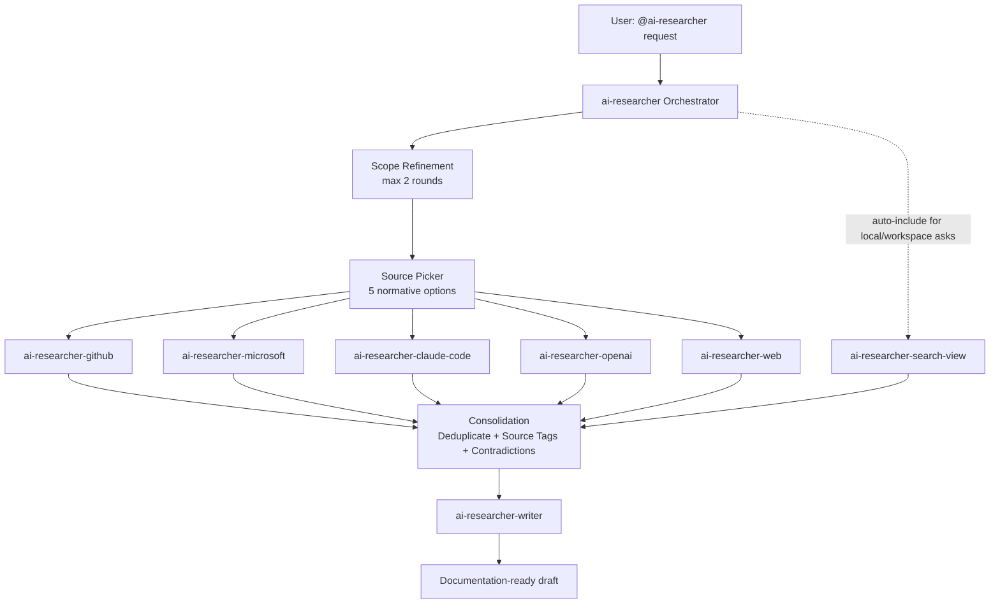

# AGENTS.md

## Project Overview

`ai-researcher` is a VS Code agent orchestration framework designed to support high-quality technical research workflows. It provides a single entry-point orchestrator agent (`ai-researcher`) that coordinates specialized agents for source-specific discovery and a writer agent for final documentation synthesis.

The framework’s core purpose is to move users from an initial question to a documentation-ready output through structured refinement, controlled source selection, parallel specialist delegation, and consolidated synthesis. It is optimized for three outcomes: reliable research, clear synthesis, and production-grade documentation writing.

By centralizing orchestration logic and separating source concerns into dedicated specialists, the project reduces context drift across long research tasks and makes maintenance easier. Each specialist remains focused and replaceable, while orchestration behavior stays consistent and auditable.

## Agent Architecture

The architecture uses one orchestrator and seven specialists:
- **Orchestrator (entry point):** `ai-researcher`
- **Specialists:** `ai-researcher-github`, `ai-researcher-microsoft`, `ai-researcher-claude-code`, `ai-researcher-openai`, `ai-researcher-web`, `ai-researcher-search-view`, `ai-researcher-writer`

The orchestrator pattern ensures all requests pass through a single control plane that handles scope refinement, source selection, fan-out delegation, consolidation, and drafting handoff. This keeps research behavior predictable while allowing each specialist to evolve independently.



## Source Picker Behavior (Critical)

### Normative source picker rules

- Exactly **5 user-selectable sources** must be shown whenever source selection is needed:
  1. **GitHub Docs**
  2. **Microsoft Docs**
  3. **Claude Code Docs**
  4. **OpenAI Docs**
  5. **Web Search**
- The picker is **normative**: options must **never** be filtered, removed, renamed, or reordered by perceived relevance.
- `get-search-view-results` is **auto-included** for workspace/local questions and must **not** appear in the picker.

### Required `vscode_askQuestions` JSON

```json
{
  "questions": [
    {
      "header": "select_sources",
      "question": "Which sources should I search?",
      "multiSelect": true,
      "options": [
        {
          "label": "GitHub Docs",
          "description": "Official GitHub documentation and related product docs"
        },
        {
          "label": "Microsoft Docs",
          "description": "Microsoft Learn, Azure, and official Microsoft documentation"
        },
        {
          "label": "Claude Code Docs",
          "description": "Official Claude Code documentation"
        },
        {
          "label": "OpenAI Docs",
          "description": "Official OpenAI documentation"
        },
        {
          "label": "Web Search",
          "description": "Broader web search when official docs are insufficient"
        }
      ]
    }
  ]
}
```

## Agent Responsibilities

| Agent | Responsibility |
|---|---|
| `ai-researcher` | Refines scope, routes to specialists, consolidates findings, and delegates to writer. |
| `ai-researcher-github` | Searches GitHub documentation sources. |
| `ai-researcher-microsoft` | Searches Microsoft documentation sources. |
| `ai-researcher-claude-code` | Searches Claude Code documentation sources. |
| `ai-researcher-openai` | Searches OpenAI documentation sources. |
| `ai-researcher-web` | Performs web search for broader discovery. |
| `ai-researcher-search-view` | Searches workspace/local context via current VS Code Search view results. |
| `ai-researcher-writer` | Synthesizes consolidated findings into draft-ready documentation. |

## Workflow

1. User asks `@ai-researcher`.
2. Orchestrator refines scope (topic, audience, output type), with a maximum of 2 refinement rounds. If scope remains unclear after 2 refinement rounds, proceed with stated assumptions and list them explicitly in the final output.
3. Orchestrator asks the user to select sources via `vscode_askQuestions` using the normative 5-option picker. If the user selects no sources or dismisses the picker, re-ask once; if the selection is still empty, default to Web Search and state this default to the user.
4. For workspace/local-project questions, `get-search-view-results` is auto-included (not user-selectable). Auto-include it when the user references files, paths, symbols, or code in the currently open workspace, or explicitly asks about “this project” or “my code”; otherwise, do not include it.
5. Orchestrator delegates selected research tasks to specialists in parallel. If a specialist fails or returns no findings, note the failure in the consolidated output under a `Source gaps` section and continue with the remaining specialists rather than aborting.
6. Specialists return findings with explicit source attribution.
7. Orchestrator consolidates findings: deduplicates, tags by source, and flags contradictions.
8. Consolidated findings are delegated to `ai-researcher-writer` for documentation drafting.
9. Writer returns a documentation-ready draft.

## Development Conventions

### Configuration and platform boundaries

- Canonical MCP server configuration lives in [`mcp.json`](mcp.json); [`.mcp.json`](.mcp.json) is a compatibility symlink.
- MCP servers are HTTP-based search/documentation endpoints used by specialists.
- VS Code extension recommendations belong in [`/.vscode/extensions.json`](.vscode/extensions.json), **not** in `mcp.json`.

### Adding a new specialist agent

Any new specialist must:
- Implement delegation through `runSubagent` with a clear prompt payload.
- Return findings with source attribution.
- Handle errors gracefully and surface failure states explicitly.
- Follow naming convention: `ai-researcher-{source-name}`.

### Known limitations

- `/chronicle tips` may present cloud SQL data-source mismatch behavior (local reindex state vs cloud query returns).

## Reference Links

| Category | Path | Purpose |
|---|---|---|
| Agent Definitions | [`agents/`](agents/) | Canonical orchestrator and specialist agent definitions. |
| Packaged Agents | [`com.github.copilot/agents/`](com.github.copilot/agents/) | Compatibility symlinks for the packaged Copilot layout. |
| Configuration | [`mcp.json`](mcp.json) | Canonical MCP server definitions for documentation/search backends. |
| Configuration Alias | [`.mcp.json`](.mcp.json) | Compatibility symlink to the canonical MCP configuration. |
| Configuration | [`.vscode/extensions.json`](.vscode/extensions.json) | Recommended VS Code extensions. |
| Documentation | [`README.md`](README.md) | Project overview and usage context. |
| Outputs | [`output/`](output/) | Generated research and documentation artifacts. |
